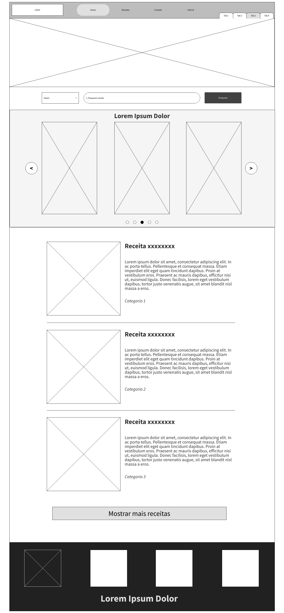
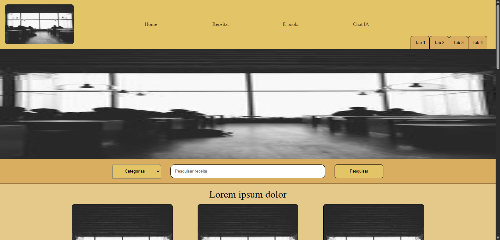
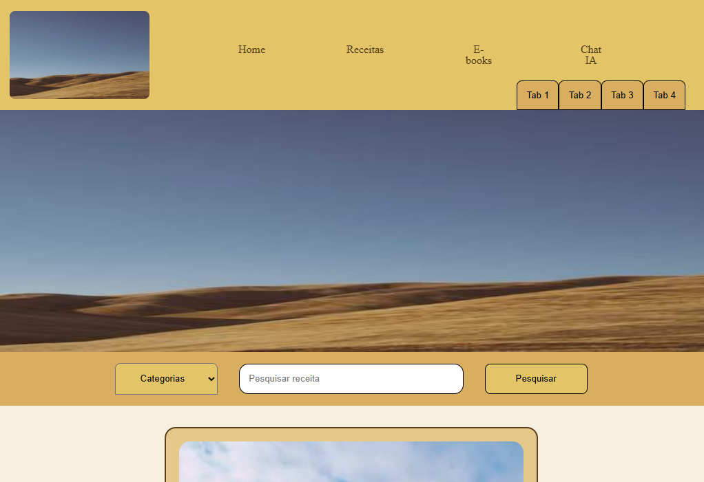
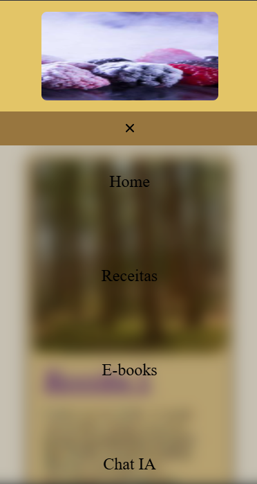

# Site Receitas
O projeto é um site que compartilha algumas receitas que gosto. Desenvolvido para a disciplina de Desenvolvimento de Interfaces Web.

Para o trabalho da semana 4, criei um projeto simples que compartilhará algumas receitas. Nele, tem imagens principais grandes e chamativas no começo, um carrossel com mais imagens de receitas e alguns links de receitas abaixo, com mais descrições, nome e categoria dela.

## Aluno: Natanael Leandro Alves Barbosa (928167)

## Wireframe:

## Prints:

- **Print HomePage Computador**
  

- **Print HomePage Laptop**
  

- **Print HomePage Mobile**
  

